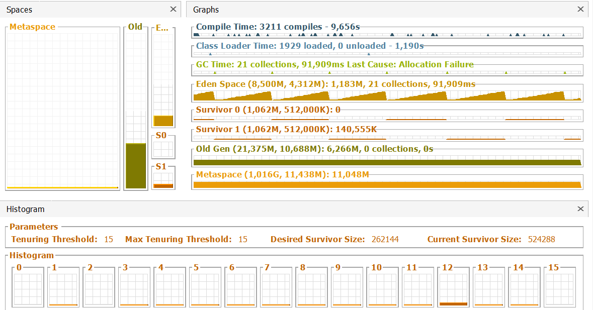
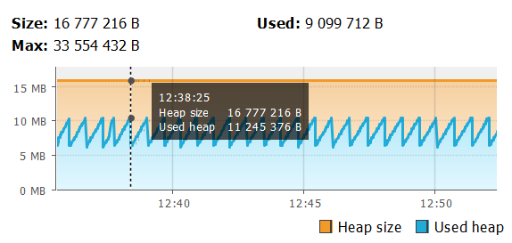
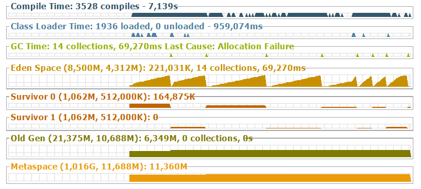
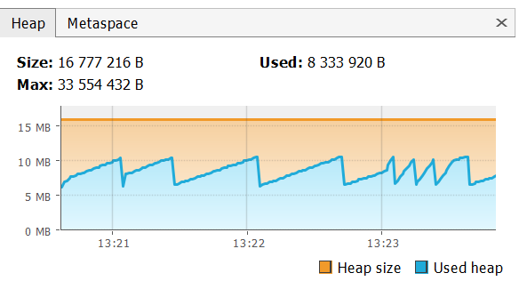

**Профилирование выполняется с помощью VisualVM**

* Выбран Serial GC и размер кучи (16-32Мб).
В ожидании ввода программа постоянно создает объекты,
помещает их в Eden и по мере заполнения до заданной 
степени наполненности GC производит сборку мусора. Вследствие 
этого можно наблюдать пилообразный график на временной шкале:

* Похожим образом выглядит график использования кучи:

* Следующий вывод заключается в том, что заполненность 
области Old определяется первоначальным моментом запуска
и в процессе работы приложения заметно не меняется.
* Создание/удаление заявки особым образом не сказывается на заполненности heap, 
пилообразность графиков Eden и heap usage сохраняется.
* Отображение всех заявок при многократном повторении этой операции
вызывает более быстрое заполнение области Eden, что ускоряет запуск сборки
мусора:

* Ограничив размер heap 4Мб можно добиться OutOfMemoryError в момент
создания новой заявки. До создания заявки приложение работает практически
с полностью заполненной кучей (раздел Old полностью заполнен, возможности 
помещать туда объекты нет):

